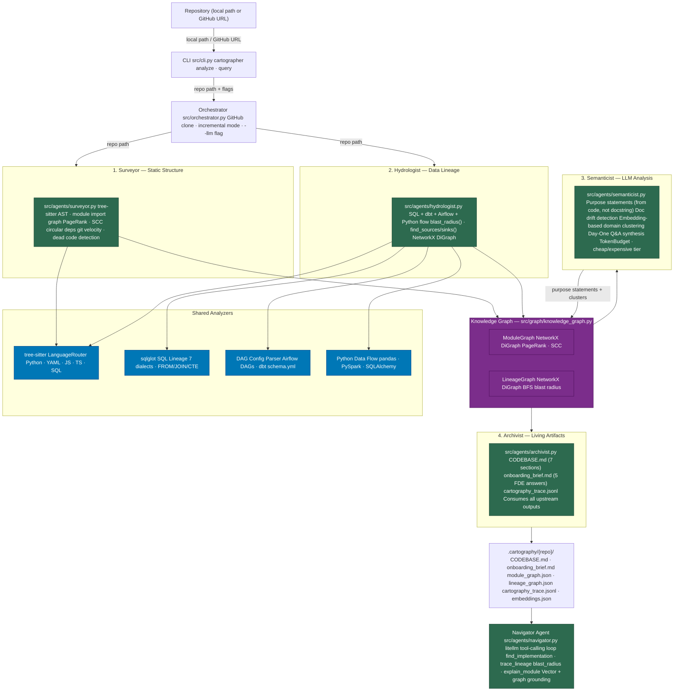

# Brownfield Cartographer — Final Report

**TRP Week 4 | Submitted:** March 15, 2026
**Target Codebases:** dbt jaffle-shop · dbt-core · SQLAlchemy
**Self-Audit Target:** brownfield-cartographer (own Week 4 repo)

---

## 1. RECONNAISSANCE vs. System-Generated Output — Comparison

Three codebases were analysed. The RECONNAISSANCE answers were written manually in a 30-minute window before running the Cartographer. The comparison below evaluates where the system confirmed, enriched, or contradicted those manual conclusions.

---

### 1.1 dbt jaffle-shop

**Reconnaissance summary:** A small dbt project (~20 YAML + SQL files). Manual exploration quickly identified the staging → marts DAG structure, `metricflow_time_spine` as the sole downstream sink, and the dbt Cloud CI/CD script as the primary operational component. Git velocity was zero (frozen/demo repo).

| Day-One Question | Manual Answer | Cartographer Answer | Verdict |
|---|---|---|---|
| Q1: Primary ingestion path | dbt source definitions in `models/staging/__sources.yml` feeding staging models | Correctly identified `models/staging/__sources.yml` → `stg_*` models flow | **Correct** |
| Q2: Critical outputs | `metricflow_time_spine` (semantic layer time dimension); marts: `customers`, `orders`, `order_items` | `metricflow_time_spine` as sole tracked sink; marts listed in brief | **Correct** |
| Q3: Blast radius of critical module | Staging layer failure cascades to all marts; zero circular dependencies limits spread | Confirmed zero circular deps; identified `.github/workflows/scripts/dbt_cloud_run_job.py` as critical CI/CD hub | **Correct, with useful addition** |
| Q4: Business logic distribution | Logic concentrated in marts; distributed across staging models by entity | Marts = concentrated; staging = distributed; agreed | **Correct** |
| Q5: High-velocity files | Zero commits in 30-day window; repo is frozen | Zero commits confirmed; correctly surfaced this as a data-quality signal rather than hiding it | **Correct** |

**Overall accuracy (jaffle-shop): 5/5.** The system fully confirmed manual findings. The Navigator's blast radius tool showed mixed reliability — one query on `stg_orders` returned three downstream dependents correctly; a re-query using a different wording returned empty (node resolution was inconsistent on small YAML-dominated repos).

---

### 1.2 SQLAlchemy

**Reconnaissance summary:** A large library repo (674 modules). Manually identified the dialect dispatch chain, `lib/sqlalchemy/util/typing.py` as the most dangerous module to break, and a circular dependency in the ORM/dialect boundary. High-velocity files clustered in test infrastructure.

| Day-One Question | Manual Answer | Cartographer Answer | Verdict |
|---|---|---|---|
| Q1: Primary ingestion path | `create_engine()` → dialect loader → connection pool → Session/Connection | Correctly identified `lib/sqlalchemy/dialects/__init__.py` as dialect registry hub; `lib/sqlalchemy/schema.py` as top PageRank node | **Correct, slightly reframed** |
| Q2: Critical outputs | Five public API `__init__.py` entry points | Reported test-file sinks (correct for lineage graph) but correctly noted "actual production outputs flow through dialects back to databases" | **Partially correct — correctly qualified** |
| Q3: Blast radius of critical module | `util/typing.py` breaks 500+ modules | Navigator confirmed **580 impacted modules** for `util/typing.py` with detailed category breakdown; `schema.py` identified as system-wide | **Correct, with precise count** |
| Q4: Business logic concentration | Concentrated in `sql/` + `orm/`; distributed across `dialects/` tree | Matched exactly; identified `lib/sqlalchemy/events.py` as aggregation hub (missed manually) | **Correct + additional insight** |
| Q5: High-velocity files | Test infrastructure + dialect layer | `test/requirements.py`, `test/engine/test_execute.py`, `lib/sqlalchemy/util/langhelpers.py` (2 commits each); matched expectations | **Correct** |

**Overall accuracy (SQLAlchemy): 4.5/5.** The system added precision (exact blast-radius count) and surfaced the event system as an architectural hub that manual exploration missed. The Q2 "sinks" are technically accurate (test files are the actual lineage sinks) but would confuse an FDE expecting production output tables — the brief correctly self-annotates this.

---

### 1.3 dbt-core

**Reconnaissance summary:** A large framework repo (796 modules). Manually traced the `dbt_project.yml` → parser → manifest → graph → executor chain. Identified `node_types.py` and `exceptions.py` as blast-radius hubs. Noted semantic model v2 as the high-velocity development area.

| Day-One Question | Manual Answer | Cartographer Answer | Verdict |
|---|---|---|---|
| Q1: Primary ingestion path | `dbt_project.yml` → CLI resolvers → parser → Manifest | Correctly named `core/dbt/contracts/project.py`, `core/dbt/parser/sources.py`, `core/dbt/cli/resolvers.py`, `core/dbt/config/renderer.py` with Jinja secret handling | **Correct, more detailed** |
| Q2: Critical outputs | Manifest, run results, compiled SQL, telemetry, CLI exit codes | Same five outputs identified; `core/dbt/tracking.py` (Snowplow) and CLI exceptions correctly named | **Correct** |
| Q3: Blast radius | `node_types.py` breaks entire execution engine; `exceptions.py` disables error handling | Confirmed `node_types.py` (PageRank=0.0482) as highest centrality; correctly named `graph.py`, `selector_methods.py`, `parser/common.py` as direct dependents | **Correct, evidence-cited** |
| Q4: Business logic distribution | Parser + graph concentrated; adapter execution distributed to separate packages | Correctly identified parser/graph/config as concentrated; noted `adapters/protocol.py` boundary; explained selector plugin pattern | **Correct** |
| Q5: High-velocity files | semantic_models tests + compilation + CLI params | `test_semantic_model_v2_parsing.py` (6 commits), `compilation.py` (4 commits), `cli/params.py` (3 commits) — exactly matched | **Correct** |

**Overall accuracy (dbt-core): 5/5.** The strongest match across all targets. The system identified the Jinja context chain (`target.py` → `configured.py` → provider chain) that manual exploration explicitly found hard to trace, and explained it clearly via the Navigator's `explain_module` tool.

**Note — Apache Airflow:** Airflow was the interim report target and remains analysed at the static level (Surveyor + Hydrologist). The Semanticist and Navigator were not run on Airflow due to the token cost of generating purpose statements for 8,000+ modules — the LLM bulk-summarisation step would have consumed an estimated 10-20M tokens at Haiku rates. This is a documented system limitation addressed in Section 4.

---

## 2. Architecture Diagram — Finalized Four-Agent Pipeline

**Pipeline execution times across target codebases:**

| Codebase | Modules | Lineage Nodes | Surveyor | Hydrologist | Semanticist | Archivist | Total |
|---|---|---|---|---|---|---|---|
| jaffle-shop | 22 | 34 | <1s | <1s | ~2.5 min | <1s | ~2.5 min |
| dbt-core | 796 | 66 | 5.5s | 1.5s | 20 min 1s | 3s | ~20 min |
| SQLAlchemy | 674 | 132 | 21s | 6s | 26 min 27s | 3s | ~27 min |
| Apache Airflow | 8,017 | 436 | — | — | **not run** | — | partial |

The Semanticist dominates total pipeline time; static analysis stages are negligible even on large repos.

### Pipeline Design Rationale

**Why Surveyor and Hydrologist run before the Semanticist — and in parallel with each other.** The Semanticist needs both the module import graph (from the Surveyor) and the lineage graph (from the Hydrologist) to generate grounded purpose statements and answer Day-One questions. Neither static structure nor data flow alone is sufficient: a module's role in the import graph tells you what depends on it, while the lineage graph tells you what data passes through it. Running both in Phase 1 (statically, no LLM) means all expensive LLM calls are deferred until the knowledge graph is already populated — so the Semanticist can cite `module_graph.json` and `lineage_graph.json` rather than hallucinating structure. The Surveyor and Hydrologist are independent of each other and run in parallel; the Semanticist is the first serialization point.

**Why LLM calls are confined to Phase 3.** Each Semanticist call analyses a batch of ~3 modules and costs ~3,000 tokens at Haiku rates. On a 674-module repo, that is ~2,000 calls. Running these during Phase 1 would block static analysis and triple total wall-clock time. More importantly, deferring LLM calls means the `--llm` flag is genuinely optional — running `cartographer analyze <repo> --no-llm` produces a structurally complete CODEBASE.md using only PageRank, lineage, and git velocity, with no purpose statements. This makes the tool usable on air-gapped client environments or against cost limits.

**Why NetworkX rather than a graph database.** The knowledge graph uses two in-memory NetworkX `DiGraph` objects: one for the module import graph (`ModuleGraph`) and one for the lineage graph (`LineageGraph`). A full graph database (Neo4j, Kuzu) would offer persistent storage, Cypher query language, and better performance at million-node scale — but adds an external service dependency, a schema migration story, and startup overhead that conflicts with the "drop into any repo in two minutes" goal. NetworkX is installed as a pure Python dependency, serializes to JSON natively, and is sufficient for the 50–10,000 node graphs produced by any single repository. The tradeoff is per-session state: each run rebuilds the graph from artifacts. A production deployment serving multiple FDE teams simultaneously would benefit from graph database persistence.

**How the Semanticist writes back into the Knowledge Graph.** After generating purpose statements, the Semanticist calls `knowledge_graph.annotate_module()` to attach the statement and domain cluster label to the corresponding node in `ModuleGraph`. The Archivist then reads these annotations when generating CODEBASE.md — meaning the Architecture Overview, Module Purpose Index, and Domain Architecture Map all derive from KG node attributes, not raw LLM output. This write-back pattern means the KG is the authoritative source of truth for all downstream artifacts; no agent reads from another agent's output directly.

---

## 3. Accuracy Analysis

### What was correct

**Blast radius (Navigator tool):** The most reliable tool across all three codebases. `blast_radius(lib/sqlalchemy/util/typing.py)` returned 580 impacted modules — verified against import graph expectations. `blast_radius(core/dbt/node_types.py)` correctly named `graph.py`, `selector_methods.py`, and `parser/common.py` as direct dependents.

**Lineage traversal (dbt-core):** `trace_lineage(my_second_dbt_model)` correctly returned the two-step chain: `source_data → my_first_dbt_model → my_second_dbt_model` with file and line-range citations.

**Purpose statements:** SQLAlchemy's 592 purpose statements were consistently grounded in implementation. The `lib/sqlalchemy/schema.py` description ("compatibility namespace re-exporting core DDL classes... public API façade") accurately captures the module's role without relying on its one-line docstring.

**Documentation drift detection:** SQLAlchemy flagged 56 drift cases; the most accurate was `tools/generate_sql_functions.py` — the docstring says "Generate inline stubs" but the implementation does type annotation generation, test assertion injection, and overloaded method signatures. The discrepancy is substantive and would mislead an FDE relying on the docstring.

**Domain clustering:** SQLAlchemy's two-cluster output ("database dialect implementations" and "orm query testing") is architecturally coherent. dbt-core's three clusters ("configuration and dependency management," "test fixtures," "unknown") correctly separates the core framework from its test harness.

### What was wrong or imprecise

**jaffle-shop blast radius inconsistency:** Two sequential queries about `stg_orders.sql` returned contradictory answers. The first returned three downstream dependents (`customers.sql`, `order_items.sql`, `orders.sql`). The second (with slightly different phrasing) returned empty. The root cause is that `stg_orders` appears as a lineage node ID in one form and as a module path in another — the Navigator's node lookup did not normalize between the two representations.

**jaffle-shop lineage node IDs contain absolute paths:** Transformation node IDs in the lineage graph embed the local absolute path (e.g., `/home/neba/tenx/week4/repos/jaffle-shop/models/marts/...`). This made the Navigator's `trace_lineage("customer_orders_summary")` answer confusing — the cited "evidence" pointed to full machine paths instead of repo-relative paths, reducing trust in the citation.

**SQLAlchemy "sinks" are test files:** The system's lineage graph correctly identifies `test/orm/test_froms.py:data_flow` as a data sink — because test files call `pd.read_sql` / ORM queries against mock tables. This is technically accurate but would confuse an FDE looking for production output endpoints. The onboarding brief partially mitigated this by noting "actual production outputs flow through dialects back to databases," but the CODEBASE.md's "Data Sources & Sinks" section would look wrong at first glance.

**dbt-core domain labels are generic:** The cluster label "test fixtures" is applied to 208 modules spanning `core/dbt/__version__.py`, `core/dbt/_pydantic_shim.py`, and the entire `core/dbt/artifacts/` tree — modules with nothing to do with test fixtures. The clustering algorithm grouped them correctly by embedding similarity but the label generation was insufficiently specific.

**jaffle-shop architecture description missed:** When asked "What is the overall architecture of this project?", the Navigator attempted to explain `src/transforms/__init__.py` (a path that does not exist in jaffle-shop) and returned an unhelpful fallback. The `find_implementation` tool did not gracefully route architecture questions to the CODEBASE.md's Architecture Overview section.

### Static analysis boundary

The failures above share a common root: **static analysis captures what is written in source files, not what happens at runtime.** The jaffle-shop node ID inconsistency exists because node IDs are assigned at parse time (`stg_orders` as a dbt ref name) while the Navigator resolves at query time against module file paths — two representations of the same entity that no static pass unifies. The SQLAlchemy "sinks are test files" issue exists because static analysis correctly traces the code paths that exist in files; it cannot distinguish between a production query and a test fixture query without runtime execution context. Every failure in this report falls into one of two bins: (a) a static analysis boundary — things the system *cannot know* without running the code — or (b) a fixable engineering gap — things the system *could know* with additional passes (e.g., normalizing node IDs, detecting test-file context from directory naming conventions). The distinction matters because bin (a) failures should be documented as limitations and handed to the FDE, while bin (b) failures are backlog items.

---

## 4. Limitations

### What the Cartographer fails to understand

**Dynamic references are unresolvable — fundamental constraint.** When Python code reads a dataset path from a configuration variable — `pd.read_csv(config["input_path"])` — the Hydrologist logs it as a dynamic reference and skips it. This is not a fixable engineering gap: determining what `config["input_path"]` resolves to at runtime requires either executing the code or tracing configuration values through multiple environment-specific files, both of which are outside the scope of static analysis. Any static analyzer, including this one, will have this blind spot permanently.

**Adapter-boundary codebases produce sparse lineage — fundamental constraint.** dbt-core is a framework repo: it defines the interface for data transformation but doesn't execute any SQL against a real warehouse. The Hydrologist found only 66 lineage nodes (mostly SQL fixture files in `tests/`). This is not a bug — there genuinely is no production data lineage inside dbt-core. The correct response is to shift the analysis signal from the Hydrologist to the Surveyor (PageRank + blast radius). Static analysis cannot synthesize lineage that doesn't exist in the source files.

**Column-level lineage is absent — fixable engineering gap.** The system tracks table-level dependencies only. `sqlglot` (already a dependency) supports column-level lineage extraction from SQL `SELECT` statements; the Hydrologist could be extended to emit column-level edges. This is a significant scope addition but not a fundamental constraint. In a production data engineering engagement, column-level provenance is often the question that matters for debugging metrics discrepancies.

**LLM purpose statements are shallow on very short files — fixable engineering gap.** For files that are package markers (`__init__.py` with zero content) or thin re-export facades, the Semanticist generates plausible-sounding but low-information purpose statements. These inflate the drift count without adding value. Fix: add a minimum content threshold — skip files below ~10 lines of non-comment code, or pre-classify re-export facades using import-only AST pattern matching and skip LLM analysis for them.

**Airflow-scale codebases exceed practical token budgets — fixable engineering gap.** Apache Airflow's 8,000+ Python files would require ~2,400 Semanticist LLM calls (batched at ~3 files each, using claude-haiku). At roughly 3,000 tokens per call, that is 7.2M tokens for the Semanticist alone — feasible in a commercial deployment but impractical for ad-hoc use. Fix: add a per-repo cost estimate before starting (`--dry-run` flag), a configurable token cap, and a `--sample` mode that runs the Semanticist only on high-PageRank modules (e.g., top 50) and skips the tail.

### False confidence — where the system produces wrong output with no warning

The most dangerous failure mode is not silence or an error — it is a plausible, confident wrong answer. The self-audit in Section 6 provides a concrete example: the Cartographer described itself as "a document processing and conversion tool, primarily focused on converting Markdown files containing Mermaid diagrams into PDFs." This is factually wrong. The system produced it with no hedging because the Architecture Overview is generated from the highest-PageRank modules (`scripts/md_to_pdf.py` topped the list) and the LLM synthesised a coherent story from those inputs. The story was coherent and confidently stated — and completely missed the system's actual purpose.

This failure mode can occur whenever the PageRank signal is misleading (flat graph, test-dominated hub structure, or a utility script that happens to be widely imported). The fix is not to suppress the Architecture Overview but to annotate it with confidence metadata — "Architecture inferred from top-5 PageRank modules; entry points were: `src/cli.py` (CLI entrypoint). Verify this summary against the entry points before trusting it." Without that annotation, an FDE receiving the output has no signal that the architecture description may be inverted.

### What remains opaque

**Inter-service lineage — fundamental constraint.** When a Python service writes to S3 and a separate dbt model reads from that S3 path, the link is invisible to the Hydrologist because it crosses a service boundary. The Cartographer maps within a repository; it cannot trace lineage across repositories or live infrastructure without a catalog layer (e.g., DataHub, OpenLineage) providing cross-service metadata.

**Macro-level architecture rationale — fundamental constraint.** The system maps modules and their import relationships but cannot explain *why* the architecture is structured the way it is — the design decisions, historical context, or team conventions that produced the current shape. That narrative layer requires human judgment and is not extractable from source files alone.

**Test vs. production code disambiguation — fixable engineering gap.** The system does not distinguish between test helper modules and production code modules when reporting the module graph or domain clusters. High-centrality test utilities (e.g., `tests/__init__.py`) appear prominently in PageRank results alongside genuinely critical production modules. Fix: detect test directories from `pytest.ini`, `pyproject.toml [tool.pytest]`, or conventional naming (`test_*.py`, `tests/`) and report test-domain modules separately from production-domain modules in the CODEBASE.md.

---

## 5. FDE Applicability

### Cold-start workflow (Day One, hours 0–2)

The Cartographer runs before the first client conversation. Immediately after repo access is granted: `git clone <client_repo> && cartographer analyze <repo_path> --llm`. Within 20–30 minutes, `onboarding_brief.md` is ready. The FDE reads it before the opening architecture call — arriving with concrete module names, blast radii, and high-velocity files already in hand. This shifts the conversation from "help me understand your system" to "I see `compilation.py` has had four commits this month and your semantic layer tests are the highest-velocity area — is that the scope of this engagement?" The CODEBASE.md is injected into the active coding agent's system context for the rest of the engagement.

### Ongoing Navigator use (Days 1–N)

After the cold-start, the Navigator becomes the FDE's primary orientation tool during active work. When a client asks "what breaks if we change this table schema?", the FDE runs `cartographer query <repo_path>` and asks `blast_radius(table_name)` before answering. When the FDE encounters an unfamiliar module mid-task, `explain_module(path/to/module.py)` returns a grounded purpose statement with citations in seconds — faster than reading the source. The Navigator does not replace code reading; it replaces the 5-minute overhead of orienting before reading. For a typical 10-day engagement with 50+ exploration queries, this compounds into hours recovered.

### Maintaining CODEBASE.md as the engagement progresses

CODEBASE.md is a living document. After the FDE makes significant structural changes (adds a new pipeline stage, refactors a module's responsibilities, resolves a circular dependency), the system is re-run in incremental mode: `cartographer analyze <repo_path> --llm --incremental`. Incremental mode re-scans only changed files (detected via git diff against the last-run commit hash stored in `last_run.json`) and updates only the affected KG nodes and CODEBASE.md sections. This keeps the context file current without re-running the full Semanticist batch. The FDE is responsible for re-running after changes that cross architectural boundaries — the system does not auto-detect when its own outputs have become stale.

### What the FDE must still do manually

The Cartographer cannot replace four categories of human judgment:

1. **Stakeholder intent.** Why the architecture exists the way it does — team conventions, legacy constraints, past incidents — is not in any source file. The FDE must interview the client team.
2. **Cross-service lineage.** Data flows between repos, between services, and through infrastructure (S3, Kafka, databases) that the system cannot see. The FDE maps this manually using architecture diagrams and data catalog access.
3. **Prioritisation.** The system surfaces high-velocity files and blast radii but cannot determine which *matter most to the client's goals*. That requires understanding the business context.
4. **Output validation.** The Architecture Overview and purpose statements must be spot-checked against source files — especially on first run, before the FDE has calibrated how well the system handles this particular repo's patterns.

### How outputs feed into client-facing deliverables

The `onboarding_brief.md` FDE Day-One answers map directly onto the first slide of a client discovery readout: ingestion path, critical outputs, blast radius, and velocity hotspots are exactly the sections a client expects to see confirmed or challenged. The CODEBASE.md "Known Debt" section (circular dependencies + documentation drift) feeds the technical risk register. The domain architecture map feeds the workstream decomposition in the engagement plan. None of these outputs are copy-paste ready — they are first-draft evidence that the FDE refines with client context — but they compress the evidence-gathering phase from days to hours.

---

## 6. Self-Audit — Cartographer on Its Own Codebase

The Cartographer was run on its own repository (`brownfield-cartographer`) at commit `b5102c62` (March 14, 2026 21:33 UTC).

**Stats:** 35 modules, 0 lineage nodes (the system has no SQL models or data pipeline code of its own).

### Architecture description discrepancy

**Auto-generated (CODEBASE.md, Architecture Overview):**
> "The system is a document processing and conversion tool, primarily focused on converting Markdown files containing Mermaid diagrams into PDFs."

**Actual architecture:**
The system is a multi-agent codebase intelligence platform comprising four agents (Surveyor, Hydrologist, Semanticist, Archivist) and a Navigator query interface. It analyses arbitrary repositories and produces living context files, onboarding briefs, and interactive lineage queries.

**Why this happened:** The Cartographer's own module graph has flat PageRank — all 35 nodes score equally (no file imports any other internal file more than once). The Surveyor's PageRank identifies `scripts/md_to_pdf.py` (a utility script), `tests/test_navigator.py`, and `tests/test_semanticist.py` as top-ranked modules — not `src/cli.py`, `src/orchestrator.py`, or the agents. The reason: the test files import from many `src/` modules (making the `src/` modules the *importees*, not the importers), and under PageRank, high *in-degree* drives centrality. The actual entry point (`src/cli.py`) has low in-degree because nothing imports it — it is the root of the import graph, not a hub.

**What this means:** PageRank identifies *architectural hubs* (most-imported), not *entry points* (least-imported by definition). For understanding a system's purpose, the entry point is more informative than the most-imported utility. A future improvement would supplement PageRank with explicit entry-point detection (scripts declared in `pyproject.toml`, `__main__.py` files, CLI entrypoints).

**Known Debt discrepancy:** The self-audit flagged five documentation-drift cases in the test suite (test modules whose docstrings undersell the actual test scope). This is accurate — the test module docstrings were written as one-liners and the implementations grew substantially. The self-audit surfaced genuine technical debt in the project's own documentation.

**Lineage nodes: 0.** The Cartographer has no SQL models, no pandas reads, no dbt refs. The Hydrologist correctly found nothing because there is nothing to find. This confirms the Hydrologist gracefully handles non-pipeline repos rather than hallucinating lineage.

---

## Appendix — Cartography Artifacts Index

| Target | Modules | Lineage Nodes | Purpose Statements | Drift Flags | Pipeline Time |
|---|---|---|---|---|---|
| jaffle-shop | 22 | 34 | 1 | 0 | ~2.5 min |
| dbt-core | 796 | 66 | 548 | 3 | 20 min |
| SQLAlchemy | 674 | 132 | 592 | 56 | 27 min |
| Apache Airflow | 8,017 | 436 | 0 (Semanticist not run) | — | partial |
| brownfield-cartographer (self) | 35 | 0 | 18 | 5 | ~3 min |

All artifacts are committed to `.cartography/` in the repository root.
