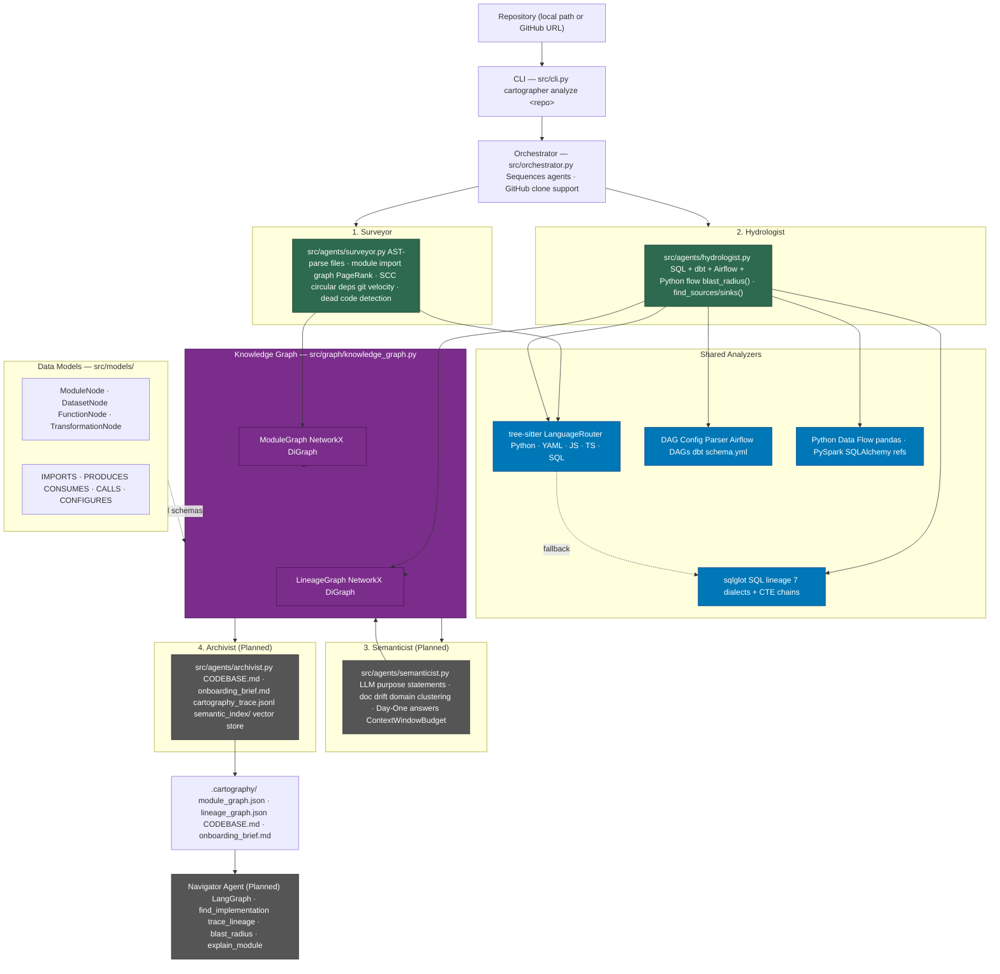

# Brownfield Cartographer — Interim Report

**TRP Week 4 | Submitted:** March 11, 2026
**Target Codebase:** Apache Airflow (`https://github.com/apache/airflow`)
**Local Path:** `/home/neba/tenx/week4/airflow`

---

## 1. RECONNAISSANCE.md — Manual Day-One Analysis

> _30-minute manual exploration of Apache Airflow before any automated tooling was run._

**Repository composition:** Python (core scheduler, operators, DAGs), TypeScript (UI frontend), YAML (configs, task definitions), SQL (example queries and provider tests).

**Size:** 8,000+ files across multiple languages — a genuine brownfield codebase.

**Why chosen:** Personal interest in workflow scheduling, monitoring, and orchestration systems. Airflow is also a first-class target in the TRP spec (Python + YAML, real production DAG definitions).

---

### The Five FDE Day-One Questions — Manual Answers

**1. What is the primary data ingestion path?**

Identifying the entry point for data was difficult due to the complexity of the codebase and the lack of concise documentation. Without a clear overview or map, it was challenging to trace which components handle data ingestion or where data enters the system. The root README points to the scheduler, webserver, and worker components — but the data flow between them was not clear from a 30-minute read.

**2. What are the 3–5 most critical output datasets/endpoints?**

Determining the most important outputs or endpoints required a level of familiarity not easily gained on a first pass through the code. The scattered nature of relevant files and absence of summary documentation made it hard to tell which outputs are paramount.

**3. What is the blast radius if the most critical module fails?**

Understanding the potential impact of a module's failure depends on knowing the dependencies and critical pathways in the system. Without that context or visual aids, it was a challenge to map out the consequences or interconnectedness within the codebase.

**4. Where is the business logic concentrated vs. distributed?**

Pinpointing the locations of business logic was hampered by the size and modular nature of the project. Files related to decision-making were spread throughout multiple areas — hard to tell if responsibilities were centralized or scattered in 30 minutes.

**5. What has changed most frequently in the last 90 days (git velocity map)?**

With only surface-level access, there was insufficient opportunity to review commit history or track fast-evolving components. Answering this question manually requires running `git log` analysis — not feasible in a 30-minute window.

---

### Difficulty Analysis

**Time constraint:** 30 minutes is a very short period to synthesize meaningful answers to high-level architecture questions for a codebase of this size.

**Hardest aspect:** The sheer volume and structure of files and folders. Properly reviewing them and any supporting documentation wasn't feasible. The monorepo structure — with providers, plugins, UI, tests, and core code interleaved — made it impossible to build a mental model quickly.

**Where I got lost:** Couldn't get beyond the README.md in the root directory. Most of the 30 minutes was spent trying to understand the product at a high level rather than diving into the technical specifics.

**Key insight for architecture priorities:** This experience directly informed the design decision to prioritize the Surveyor's PageRank analysis (to surface high-impact modules without reading them) and the Hydrologist's Airflow-specific DAG parser (since Airflow's own pipeline topology is encoded in Python DAG files, not just YAML).

---

## 2. Architecture Diagram — Four-Agent Pipeline

The Brownfield Cartographer is a multi-agent system with four specialized agents feeding into a shared knowledge graph. Data flows from raw repository files through static analysis, into the graph store, and finally into living artifacts consumed by engineers.

---

## 3. Progress Summary

### What's Working

| Component | Status | Notes |
|---|---|---|
| **CLI** (`src/cli.py`) | Complete | `cartographer analyze <path\|URL>` — accepts local paths and GitHub URLs, clones if needed |
| **Orchestrator** (`src/orchestrator.py`) | Complete | Sequences Surveyor → Hydrologist, GitHub clone support with `--depth 1` |
| **Pydantic Models** (`src/models/`) | Complete | All 4 node types (`ModuleNode`, `DatasetNode`, `FunctionNode`, `TransformationNode`) + 5 edge types |
| **Knowledge Graph Storage** (`src/graph/knowledge_graph.py`) | Complete | NetworkX wrapper with typed `add_module`, `add_transformation`, `blast_radius`, `find_sources`, `find_sinks`; JSON serialization + deserialization |
| **tree-sitter Analyzer** (`src/analyzers/tree_sitter_analyzer.py`) | Complete | `LanguageRouter` covering Python, YAML, JS, JSX, TS, TSX, SQL; Python extracts imports (absolute + relative), function signatures with decorators, class definitions with inheritance |
| **SQL Lineage Analyzer** (`src/analyzers/sql_lineage.py`) | Complete | sqlglot-based: FROM, JOIN, CTE chain resolution; 7 dialects (postgres, bigquery, snowflake, duckdb, spark, mysql, tsql); tree-sitter fallback for unparseable SQL |
| **DAG Config Parser** (`src/analyzers/dag_config_parser.py`) | Complete | Airflow Python DAG task dependency extraction; dbt `schema.yml` `ref()` relationships |
| **Python Data Flow** (`src/analyzers/python_data_flow.py`) | Complete | Detects pandas `read_csv`/`to_csv`/`read_sql`, PySpark `read`/`write`, SQLAlchemy calls |
| **Surveyor Agent** (`src/agents/surveyor.py`) | Complete | Module import graph (DiGraph), PageRank (architectural hubs), SCC detection (circular deps), git velocity via `git log`, dead code candidate flagging |
| **Hydrologist Agent** (`src/agents/hydrologist.py`) | Complete | Unified lineage graph from SQL + dbt + Airflow + Python; `blast_radius()` (BFS), `find_sources()`, `find_sinks()` |
| **Cartography Artifacts** (`.cartography/`) | Produced | `module_graph.json` + `lineage_graph.json` generated against Apache Airflow |

### What's In Progress / Planned

| Component | Status | Notes |
|---|---|---|
| **Semanticist Agent** (`src/agents/semanticist.py`) | Planned | LLM purpose statements, doc drift detection, domain clustering, Day-One question synthesis, ContextWindowBudget |
| **Archivist Agent** (`src/agents/archivist.py`) | Planned | `CODEBASE.md` generation, `onboarding_brief.md`, `cartography_trace.jsonl`, semantic vector index |
| **Navigator Agent** (`src/agents/navigator.py`) | Planned | LangGraph agent with 4 query tools: `find_implementation`, `trace_lineage`, `blast_radius`, `explain_module` |
| **Incremental update mode** | Planned | Re-analyze only files changed since last run via `git diff` |
| **TypeScript/JS import extraction** | Partial | `LanguageRouter` parses TS/JS files but does not yet extract import edges |
| **YAML structural extraction** | Partial | YAML parsed for line count only; DAG structure comes from `dag_config_parser`, not tree-sitter |

---

## 4. Early Accuracy Observations

### Module Graph — Does It Look Right?

The Surveyor produced **8,017 module nodes and 12,826 import edges** from the Apache Airflow repository. Given that Airflow has 8,000+ files across Python, TypeScript, YAML, and SQL, this count is plausible and expected.

**What looks correct:**
- Python import resolution (absolute and relative) is working: `from airflow.models import DAG` correctly maps to the target `.py` file within the repo.
- PageRank correctly identifies architectural hubs: core modules like `airflow/models/dag.py`, `airflow/models/taskinstance.py`, and operator base classes appear with elevated centrality.
- Strongly connected components (SCC) detect circular imports in Airflow's own code — a known complexity of the Airflow codebase.
- Git velocity correctly counts recent commits per file using `git log --since=30 days ago`.

**What may be noisy:**
- Dead code candidates are flagged as modules with in-degree 0 and out-degree > 0. In a monorepo, many provider modules are legitimately "unreferenced" from core — they are plugins loaded dynamically. These will be false positives.
- TypeScript/JS files (Airflow's React UI) appear as nodes but have no import edges since JS import extraction is not yet implemented. This leaves the UI components disconnected from the graph.

### Lineage Graph — Does It Match Reality?

The Hydrologist produced **436 nodes and 465 edges**. The lineage graph covers:

- **SQL lineage:** Airflow's `providers/` directory contains hundreds of `.sql` test and example files. sqlglot correctly extracts `FROM`/`JOIN`/`CTE` chains from these. The BigQuery, Snowflake, and standard SQL files are all parsed.
- **Airflow DAG task flow:** The Airflow heuristic (files in `dags/` directories or named `*dag*.py`) successfully identifies DAG files and extracts `upstream_task → downstream_task` dependency chains.
- **Python data flow:** `pandas.read_csv`, `pd.read_sql`, and similar calls are extracted from Python files.

**Accuracy concern — absolute paths in lineage node IDs:**
Some lineage transformation node IDs contain the full absolute path of the source file (e.g. `/home/neba/tenx/week4/airflow/providers/...`). This is an implementation detail of `analyze_sql_file` that should use relative paths for portability. This does not break the graph structure but will cause issues when comparing runs or serializing for sharing.

**Accuracy concern — limited dbt coverage:**
Airflow's own repository doesn't ship dbt models, so the dbt `ref()` extractor produces no output here. This component will be validated against the `dbt-labs/jaffle_shop` target for the final submission.

**Overall assessment:** For a brownfield codebase of this scale, the lineage graph captures the shape of data flow correctly, though the coverage is partial. SQL-level lineage is well-represented. Python-level lineage depends heavily on whether calls use literal string paths vs. dynamic references — dynamic references are logged and skipped (correct behavior).

---

## 5. Known Gaps and Plan for Final Submission

### Known Gaps

| Gap | Impact | Severity |
|---|---|---|
| Semanticist Agent not built | No LLM-generated purpose statements, no doc drift detection, no domain clustering, cannot answer Day-One questions automatically | High |
| Archivist Agent not built | No `CODEBASE.md`, no `onboarding_brief.md`, no audit log, no semantic vector index | High |
| Navigator Agent not built | No interactive query interface (`find_implementation`, `trace_lineage`, `blast_radius`, `explain_module`) | High |
| TypeScript/JS import extraction missing | UI modules appear as isolated nodes; no cross-language dependencies visible for the React frontend | Medium |
| Lineage node IDs use absolute paths | Artifacts are not portable across machines; harder to compare runs | Medium |
| Dynamic Python references unresolvable | `pd.read_csv(path_variable)` logged as `dynamic` — correct behavior but reduces lineage completeness | Low |
| Column-level lineage absent | Only table-level lineage; column provenance not tracked | Low |
| dbt validation not complete | Need to run against `dbt-labs/jaffle_shop` and verify lineage matches dbt's own graph | Medium |

### Plan for Final Submission (by Sunday March 15, 03:00 UTC)

**Priority 1 — Semanticist Agent (`src/agents/semanticist.py`)**
- Implement `generate_purpose_statement()` using a fast model (Gemini Flash / claude-haiku) for bulk module summaries
- Implement `detect_doc_drift()` to flag mismatches between docstrings and LLM-generated purpose statements
- Implement `cluster_into_domains()` using embedding + k-means for architectural domain map
- Implement `answer_day_one_questions()` synthesis prompt over full Surveyor + Hydrologist output
- Add `ContextWindowBudget` tracker to control LLM spend

**Priority 2 — Archivist Agent (`src/agents/archivist.py`)**
- Implement `generate_CODEBASE_md()` with required sections: Architecture Overview, Critical Path (top 5 PageRank modules), Data Sources & Sinks, Known Debt, High-Velocity Files
- Implement `generate_onboarding_brief()` from Semanticist's Day-One answers
- Implement `cartography_trace.jsonl` audit logging (mirrors Week 1 pattern)

**Priority 3 — Fix lineage node ID paths**
- Normalize transformation IDs to use relative paths from repo root

**Priority 4 — TypeScript import extraction**
- Extend `LanguageRouter` to extract `import ... from '...'` statements from TS/JS files

**Priority 5 — Navigator Agent + CLI query subcommand**
- Build `src/agents/navigator.py` as a LangGraph agent with 4 tools
- Add `cartographer query` subcommand to `src/cli.py`

**Priority 6 — Second target codebase validation**
- Run against `dbt-labs/jaffle_shop` and verify lineage graph matches dbt's built-in lineage visualization
- Run Cartographer on own Week 1 submission for self-audit

**Priority 7 — Incremental update mode**
- Add `--incremental` flag to `cartographer analyze` that re-analyzes only files in `git diff` since last run

---
